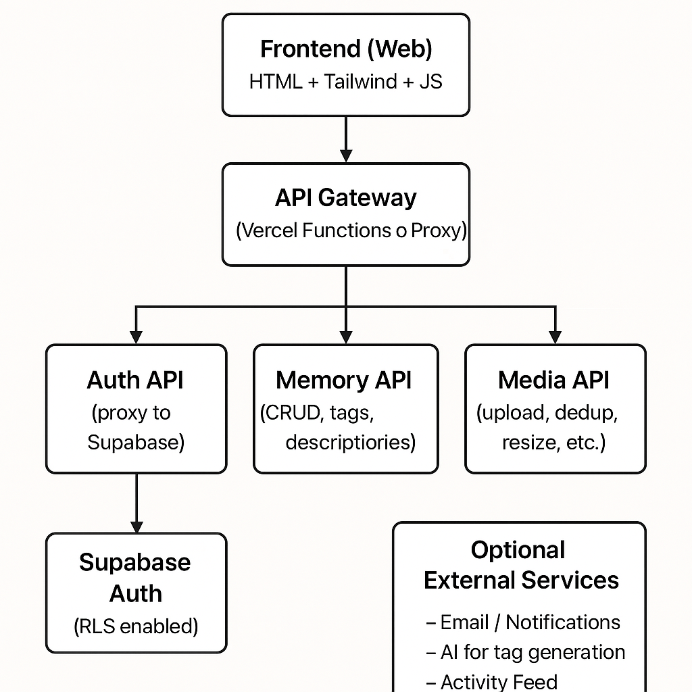

# 📘 SmritiKosha: Product Roadmap & Go-To-Market Strategy

## 🔭 Vision
SmritiKosha is a digital sanctuary where users can preserve, reflect on, and share personal memories. A journaling experience rooted in emotional resonance, nostalgia, and mindfulness.

## 🎯 Target Audience
- Teens and young adults (13–24) who capture and share moments daily
- Adults 25–45 with emotional journaling habits
- Senior citizens who enjoy sharing photos and reflecting on past memories
- Diaspora users globally (India, US, Southeast Asia, Middle East, Europe)
- Creatives, therapists, life coaches
- People seeking mindfulness, digital detox, or intentional reflection

---

## 🚧 Product Roadmap

### ✅ Phase 1: Foundation (0–1 Month)
- [x] Secure authentication with Supabase (email/password + verification)
- [x] Responsive login, signup, verification, and confirmation screens
- [x] Beautiful, emotional landing page
- [x] Personal main view with list of memories and add-memory UI
- [x] Hosted images in-app for design consistency
- [ ] Memory creation with media upload
- [ ] Session security enforcement, token cleanup
- [ ] Basic error handling, validation states

### 🛠️ Phase 2: Memory-Centric Features (1–2 Months)
- [ ] Rich text support for memory entries
- [ ] Media support: images, audio (voice memos)
- [ ] Edit/delete memories
- [ ] Tagging system: emotion, location, decade
- [ ] Search and filter by keyword or tag
- [ ] Private/public setting per memory

### 🌱 Phase 3: Growth Hooks (2–3 Months)
- [ ] “Memory Capsule” time-locked entries
- [ ] Periodic “memory resurfacing” via email
- [ ] Memory timelines and mood graphs
- [ ] Shared memory walls (for families, couples, groups)
- [ ] Export/backup to PDF or plain text

### 🌎 Phase 4: Community + Monetization (3–6 Months)
- [ ] User profiles
- [ ] Follow and comment on public memories
- [ ] Premium subscription model
  - Custom themes
  - Audio-to-text journaling
  - AI-generated memory prompts
  - Priority support
- [ ] Billing integration (Stripe)
- [ ] Analytics dashboard for users (sentiment, frequency)

### 📱 Phase 5: Multi-Channel Expansion (6+ Months)
- [ ] Native mobile app (iOS/Android)
- [ ] Push notification engine (reminders, resurfaced memories)
- [ ] App-specific UX improvements (offline draft, voice notes)
- [ ] PWA support for cross-platform sync
- [ ] Device sync + secure encrypted cloud storage

---

## 🚀 GTM STRATEGY

### 🧲 Product-Led Growth (PLG) Core
- Free tier with strong emotional UX
- Viral mechanics: shared public memories, memory challenges
- “Start journaling now” frictionless onboarding
- In-app upgrade nudges via emotional touchpoints

### 📢 Marketing Channels
- Instagram + Pinterest (visual nostalgia, aesthetic)
- Reddit journaling and therapy communities
- Medium blog with personal stories and reflections
- YouTube shorts: memory quotes, how-to use

### 👥 Early Adopter Tactics
- Invite-only launch for emotional safety
- Collect testimonials from beta users
- Partner with mindfulness coaches & journaling influencers

### 💳 Subscription Pricing (Refined Model)

- **Free Tier – Try It Out**
  - Create up to 1 memory
  - Attach up to 10 images
  - Basic search
  - No sharing features
  - Designed to hook first-time users with the emotional experience

- **Light Plan – $1.99/month**
  - Up to 5 memories
  - Up to 20 photos per memory
  - Access to tagging and filters
  - Export to print format (PDF)
  - Ideal for light users who journal occasionally

- **Premium Plan – $4.99/month**
  - Unlimited memories
  - Unlimited media (photo/audio)
  - AI-generated prompts
  - Memory resurfacing reminders
  - Priority support
  - Export to print format (PDF)
  - **Reel Builder** feature: Create emotional video-style reels using memory images with transitions, music, and captions
    - Non-copyright music/audio only
    - User-defined image order
    - Export as short video or GIF

- **Elite Plan – $9.99/month**
  - Everything in Premium, plus:
  - AI-powered memory sorting and mood tagging
  - Smart deduplication of similar photos
  - AI image enhancements (color correction, sharpen, light restoration)
  - Auto-generated memory summaries using GPT
  - "Memory-to-Story": Turn selected photos + notes into narrative prose
  - Export reels with voice narration via AI

### 🛡️ Fair Use Policy & Anti-Sharing Measures
- Account sharing discouraged with active monitoring of:
  - Login patterns and device IPs
  - Session duration anomalies
- Implement soft limits on:
  - Concurrent logins
  - Device switching frequency
- Optional: Offer **Family Plan** (Coming soon)
  - 4 linked accounts under one admin
  - $9.99/month — each user has their own private space

### 🤝 Sharing Features
- **Premium and Elite** users can:
  - Invite collaborators to a memory with view-only or limited upload access
  - Shared memory contributors must have at least a Free account
  - Shared memories support **up to 2 collaborators** per memory (Premium)
  - Elite users can share with **up to 5 collaborators** per memory and manage access roles
  - Only the original owner can delete or edit memory metadata

**Use cases:**
- Collaborate on travel memories with friends
- Create shared family albums or events
- Allow contributors to tag themselves or leave comments

**Limitations:**
- Shared memories do not count toward collaborators' memory limits
- Light/Free users cannot initiate shared memories
- Excessive use of shared memory invites may trigger soft limit prompts

**Future:**
- Group Plan with fully linked memory spaces (3–5 users under one subscription)

---

## 🧠 Notes
- Media = images only (JPG, PNG, WebP)
  - No video/audio in current scope
  - Max 10MB per image
  - Limits apply based on subscription tier
- Privacy-first approach: no data sharing, no creepy tracking
- Future: native mobile app, encrypted backup, emotion detection

---

## 📌 Next Steps
- Finalize media upload
- Add edit/delete memory
- Implement tagging system
- Prep public launch landing + waitlist
- Upload this doc to repo

## 📌 Future Architecture Outlook (Proposal)

# 💡 Bonus Ideas for SmritiKosha (Scalable Add-ons)

## 1. AI Auto-tagging
Automatically generate memory tags based on image content using Vision APIs (e.g. Google Vision, AWS Rekognition). 
Trigger this as a background job after image upload.

## 2. Background Jobs / Queue Support
Use something like Supabase Edge Functions or a lightweight job queue (e.g. BullMQ) to process:
- image metadata extraction  
- deduplication hashing  
- AI classification  
- email sending

## 3. Public Memory Sharing
Allow users to make certain memories public (read-only) and generate shareable URLs:  
`smritikosha.app/m/memory-title`  
Optionally cache on CDN for speed.

## 4. Highlights & Collections
Let users group multiple memories into a “highlight” — similar to Instagram story highlights.

## 5. Mobile App Support
Use the same backend API and offer a PWA or native app via Capacitor or React Native.

## 6. Analytics / Memory Stats
Track memory views, shares, most used tags — and show personal insights.

## 7. Friends & Collaboration
Invite others to contribute to a memory (shared albums, stories, roadtrips).

## 8. Privacy Controls
Let users set visibility levels:
- Private  
- Friends-only  
- Public

## 9. Versioned Memories
Let users restore a previous version of a memory (title, tags, photos).

## 10. Commenting or Annotations (Optional)
Allow memory collaborators to comment on specific images or memories.

